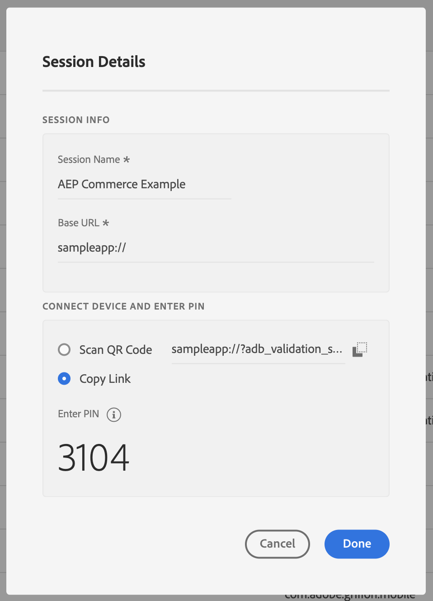
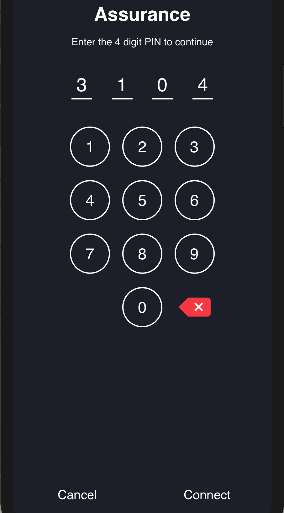

# Tutorial - Sample App


The Adobe Experience Platform - Experience Edge - Mobile extension is currently in BETA. Use of this extension is by invitation only. Please contact your Adobe Customer Success Manager to learn more and get access to the materials for this tutorial.


This tutorial illustrates how you may send commerce events to Adobe Experience Platform via Experience Edge using the Experience Edge extension.


The application is provided in Android and iOS \(Swift\) as part of the beta welcome packet - please contact your beta manager for further detail.


The demo mobile application has multiple tabs. For this exercise, the `AEP` and `Assurance` tabs will be used, demonstrating XDM commerce events in a mobile application.

## Setup the demo app




### Prerequisites

* Android Studio 3.+ with an Android emulator running Android 7.0+
* Gradle 4.4+

### Configure and run project

1. Open Android Studio.
2. From Android Studio, open the `Android/demo/settings.gradle` project file as an existing project.
3. Run `sync gradle` and confirm there are no errors.
4. Now, run the app `experience-platform-commerce-demo-app` on your Android emulator or physical device to launch the demo application.



### Prerequisites

* Xcode 11.+, Swift 5.+ with an iOS simulator running iOS 13.+
* CocoaPods, 1.8.0+

### Configure and run project

1. In your terminal run the CocoaPods command and wait for the AEP Mobile SDK to be downloaded:

   ```text
   $ cd Swift 
   $ pod install
   ```

3. Open AEPCommerceDemoApp.xcworkspace in Xcode:

   ```text
   $ open AEPSampleApp.xcworkspace
   ```

4. Run the target `AEPSampleApp` on an iPhone emulator or physical device.



## Configure the demo app

This application uses a default configuration. To configure the Adobe Mobile SDK with your own Adobe Experience Cloud Org ID and Experience Edge configuration ID, follow the steps to [Generate Environment Identifier](https://aep-sdks.gitbook.io/docs/beta/experience-platform-extension/experience-platform-setup) and then, update the following:

1. Open **ADBMobileConfig.json** in the project's **assets** folder.
2. Set **experienceCloud.org** to your assigned Experience Cloud organization ID.
3. Set **experiencePlatform.configId** to your Experience Edge configuration ID.
4. Update the **dataset identifier** in the MobileSDKComerceSchema: 1. Navigate to [https://experience.adobe.com/platform/dataset/browse](https://experience.adobe.com/platform/dataset/browse) and select the dataset you created in the previous step. 2. From the right panel, copy the Dataset ID value. 3. Update the dataset identifier for your commerce schema:

   a. Android - Replace the value returned by the MobileSDKCommerceSchema `getDatasetIdentifier` API with the value you copied at Step 4.2.

   b. iOS - Replace the value returned of the MobileSDKCommerceSchema `datasetIdentifier` property with the value you copied at Step 4.2.

## Use the demo app

### Adobe Experience Platform extension and XDM objects

This application uses the Experience Platform extension for sending XDM formatted data to the Adobe Experience Edge and so to Adobe Experience Platform. The XDM data is modelled based on the XDM Schemas you have configured in Adobe Experience Platform.

The sample app includes automatically generated source classes for the XDM Objects that define the commerce mixin configured in the previous step. To explore these, check the `MobileSDKCommerceSchema`  class and its usages in `ExperiencePlatformViewController.swift (iOS)` / `PlatformTab.java (Android)`.

**Note:** If you would like to use more complex XDM Schemas for your application, the Mobile SDK team can help generating the XDM classes for your Android or Swift implementation similar with the ones used in the commerce example, so please contact your Adobe representative.

### Application views

#### Product list page

The product list page displays a scrollable list of product items for "sale". Selecting a product takes the user to a product details page. Clicking the cart button takes the user to the shopping cart list page.

#### Product details page

The product details page displays a single product from the product list. Here, users can select a quantity and add the product to their cart.

When this page is loaded, a `commerce.productViews` Experience Platform event is sent to the Adobe Experience Edge.

```javascript
"events": [
  {
    "xdm": {
      "_id": "159df588-b19c-4911-8339-5e9810e10fe2",
      "eventType": "commerce.productViews",
      "commerce": {
        "productViews": {
          "value": 1
        }
      },
      "productListItems": [
        {
          "quantity": 0,
          "priceTotal": 0,
          "name": "Red",
          "SKU": "625–740"
        }
      ],
      "timestamp": "2019-11-18T16:47:39-08:00"
    }
  }
]
```

Clicking the **Add to Cart** button adds the product with the selected quantity to the user's cart. In addition, a `commerce.productListAdds` Experience Platform event is sent to the Adobe Experience Edge.

```javascript
"events": [
  {
    "xdm": {
      "_id": "433184ab-8088-4b3c-9261-5752a2502cc1",
      "eventType": "commerce.productListAdds",
      "commerce": {
        "productListAdds": {
          "value": 1
        }
      },
      "productListItems": [
        {
          "quantity": 1,
          "productAddMethod": "add to cart button",
          "priceTotal": 9.95,
          "name": "Red",
          "SKU": "625–740",
          "currencyCode": "USD"
        }
      ],
      "timestamp": "2019-11-18T16:49:04-08:00"
    }
  }
]
```

#### Cart list page

The cart list page displays the list of products the user has added to their cart.

Users can remove items from their cart by clicking the **Remove** button. When a product is removed, a `commerce.productListRemovals` event is sent to the Adobe Experience Edge.

```javascript
"events": [
  {
    "xdm": {
      "_id": "95c8166a-8404-4ba9-adc7-dc94b2f7f388",
      "eventType": "commerce.productListRemovals",
      "commerce": {
        "productListRemovals": {
          "value": 1
        }
      },
      "productListItems": [
        {
          "quantity": 1,
          "priceTotal": 9.95,
          "name": "Red",
          "SKU": "625–740",
          "currencyCode": "USD"
        }
      ],
      "timestamp": "2019-11-18T16:49:57-08:00"
    }
  }
]
```

Selecting the **Checkout** button takes the user to the checkout page.

#### Checkout page

The checkout page allows the user to select a payment type and purchase the products in the cart.

The payment type is hardcoded to either "cash" or "credit card", there is no option to enter billing information. When the checkout page is loaded, a `commerce.checkouts` Experience Platform event is sent to Adobe Experience Edge. In a production application, there may be several `commerce.checkouts` events, one for each checkout step, depending on the complexity of the checkout workflow. This demo application only has this single checkout step.

```javascript
"events": [
  {
    "xdm": {
      "_id": "03397915-7501-42ba-9d0a-87d491317448",
      "eventType": "commerce.checkouts",
      "commerce": {
        "checkouts": {
          "value": 1
        }
      },
      "productListItems": [
        {
          "quantity": 1,
          "priceTotal": 9.95,
          "name": "Red",
          "SKU": "625–740",
          "currencyCode": "USD"
        },
        {
          "quantity": 2,
          "priceTotal": 21.9,
          "name": "Green",
          "SKU": "495–570",
          "currencyCode": "USD"
        }
      ],
      "timestamp": "2019-11-18T16:50:49-08:00"
    }
  }
]
```

When the user clicks the **Purchase** button, a `commerce.purchases` experience platform event is send to Adobe Data Platform. After the purchase is complete, the shopping cart is cleared and the user is navigated back to the product list page.

```javascript
"events": [
  {
    "xdm": {
      "_id": "79b3d0d8-01e5-45e7-8cb8-1e7e359e1448",
      "eventType": "commerce.purchases",
      "commerce": {
        "purchases": {
          "value": 1
        },
        "order": {
          "payments": [
            {
              "currencyCode": "USD",
              "paymentAmount": 31.85,
              "paymentType": "Credit Card"
            }
          ],
          "priceTotal": 31.85,
          "currencyCode": "USD"
        }
      },
      "productListItems": [
        {
          "quantity": 1,
          "priceTotal": 9.95,
          "name": "Red",
          "SKU": "625–740",
          "currencyCode": "USD"
        },
        {
          "quantity": 2,
          "priceTotal": 21.9,
          "name": "Green",
          "SKU": "495–570",
          "currencyCode": "USD"
        }
      ],
      "timestamp": "2019-11-18T16:51:28-08:00"
    }
  }
]
```

### Using AEP Assurance

AEP Assurance (also known as Project Griffon) is a product from Adobe to help you inspect, validate, and debug data collection and experiences for your mobile application. The demo app is already set up to use Adobe's AEP Assurance mobile extension, which allows you to view the events being sent through the AEP Mobile SDK.

1. To use AEP Assurance, follow the [Using Project Griffon](https://aep-sdks.gitbook.io/docs/beta/project-griffon/using-project-griffon) instructions.
2. When asked for the **Base URL**, enter `sampleapp://`.
3. After starting an Assurance session from [https://experience.adobe.com/griffon](https://experience.adobe.com/griffon), click on the the Session Details button on the right corner of the Project Griffon page and copy the session link and note down the PIN.

   

4. Go to the Adobe Experience Platform mobile extension demo application that is installed on your Android/iOS device or simulator, and click on the Assurance tab.
5. This will take you to the Assurance Connect Page. Now, paste the Assurance Session URL that you copied from [https://experience.adobe.com/griffon](https://experience.adobe.com/griffon), and click `Connect`.

   

6. Now, this will take you to the Assurance Connect Login Page. Enter the PIN that you noted from from [https://experience.adobe.com/griffon](https://experience.adobe.com/griffon) and click `Connect`.

   

7. Once connected to Assurance, you will see an AEP Icon in red color on the top right corner of the Product List Page. The color of this AEP Icon will become gray if the connectivity to Assurance server is lost for some reason. In this case, you want to reconnect to continue to see the session in the UI.
8. In the Assurance session, you should now start seeing events populating the Events List. When navigating through the sample app you should see the Experience events sent to Experience Edge. For more details, refer to [Event types handled by the AEP Mobile extension](https://aep-sdks.gitbook.io/docs/beta/experience-platform-extension/experience-platform-debugging).

### Queries in Experience Platform

After using the sample demo application to view products and checkout items in a cart, the XDM Experience Events containing the commerce data are sent to the Adobe Experience Platform through Experience Edge.

**Note:** It may take up to 15-20mins before the data is ingested in Experience Platform.

You can query the dataset which stores the data for your Schema by doing the following:

1. Log in to [https://experience.adobe.com/platform](https://experience.adobe.com/platform) using your Adobe credentials.
2. Select your Adobe Experience Cloud Organization to the organization ID used to configure the demo application.
3. On the navigation panel, under Data Management, select **Queries**.
4. Click the **Overview** tab, then click **Create query**.
5. In the text box, enter a SQL query against your dataset table. Here is an example:

   ```text
   select * from moble_sdk_platform_event 
       where eventType = 'commerce.productViews' LIMIT 5
   ```

   **Note:** The dataset table name might be different based on the dataset name you created.

6. Click the "Play" icon in the top-left corner above the query text box to run the query. The results will appear in the **Results** tab in the bottom panel.
7. Alternately, click the **Browse** tab and select a previously saved query, such as **Mobile Commerce Product Adds**.

### Next steps

If you would like to explore other XDM Schemas for your mobile use-case, find more details in the [Adobe Experience Platform - Experience Edge](https://aep-sdks.gitbook.io/docs/beta/experience-platform-extension) page.

