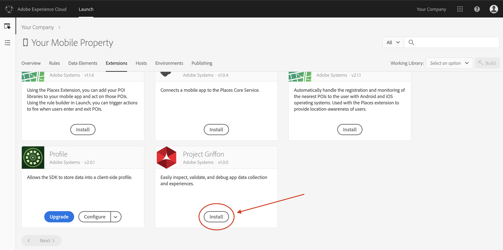

# Set up Project Griffon


Project Griffon is a beta product. To use it, you must accept the terms on [https://experience.adobe.com/griffon](https://experience.adobe.com/griffon). 



Beta products are not supported by Adobe customer care or Adobe Experience Cloud community forums. Please use the Slack channel provided in your beta invite email to ask and resolve concerns.


## How to participate in the Project Griffon beta

1. [Request access to Project Griffon](set-up-project-griffon.md#request-access-to-project-griffon) by filling out the intake form
2. [Setup your app for Project Griffon](set-up-project-griffon.md#setup-app-for-project-griffon)
3. Visit [Project Griffon](https://experience.adobe.com/griffon) to start your first session

## Request Access to Project Griffon

Please fill out [this form](https://forms.microsoft.com/Pages/ResponsePage.aspx?id=Wht7-jR7h0OUrtLBeN7O4UJN9zAhIEhJr3PBfyMf9wdUMjNHTjVCVUJXUDM0VUIzOUFWMk9RNlBLRC4u) to request access for Project Griffon.


Beta participation requires a valid, active Adobe Experience Cloud contract. Beta participation is subject to terms \(as listed above\). Project Griffon team do their best to respond on your participation request within 48-72 hours after form submission.


You may access Project Griffon by visiting [https://experience.adobe.com/griffon](https://experience.adobe.com/griffon).

## Setup app for Project Griffon

Follow these steps to add Project Griffon to your app:

1. Follow instructions to implement the new Adobe Experience Platform Mobile SDK \(skip if already done\)
2. Add the Project Griffon Extension to your app
   1. In Experience Platform Launch, click the **Extensions** tab.
   2. On the **Catalog** tab, locate the **Project Griffon** extension, and click **Install**.
   3. Follow the publishing process to update SDK configuration.
3. Implement Project Griffon SDK APIs in your app



### Add Project Griffon Extension to your app


Use the latest versions of the Adobe Experience Platform Mobile SDK and Project Griffon SDK extension to try out our newest functionality.


#### Add Project Griffon



**Java**

1. Add the following libraries in your project's `build.gradle` file:

   ```java
   implementation 'com.adobe.marketing.mobile:core:1+'
   implementation 'com.adobe.marketing.mobile:griffon:1+'
   ```

2. Import the Project Griffon libraries with the other SDK libraries:

   ```java
   import com.adobe.marketing.mobile.Griffon; 
   import com.adobe.marketing.mobile.MobileCore;
   ```



Add the library to your project via your [Cocoapods](https://cocoapods.org/pods/ACPGriffon) `Podfile` 

```text
pod 'ACPCore'
pod 'ACPGriffon'
```

Import the Project Griffon libraries along with other SDK libraries:

#### Objective-C

```objectivec
#import "ACPCore.h"
#import "ACPGriffon.h" // <-- import the Project Griffon library
```

#### Swift

```swift
import ACPCore
import ACPGriffon // <-- import the Project Griffon library
```



#### Register Griffon with Mobile Core



Registering the extension with Core, sends Experience Platform SDK events to an active Project Griffon session. To start using the extension library, you must first register the extension with the [Mobile Core](https://aep-sdks.gitbook.io/docs/using-mobile-extensions/mobile-core) extension.

#### Java

1. Register the extension when you register other extensions.

   ```java
     public class MobileApp extends Application {
      @Override
      public void onCreate() {
         super.onCreate();
         MobileCore.setApplication(this);
         MobileCore.configureWithAppId("yourAppId");
         try {
            Griffon.registerExtension();
            MobileCore.start(null);
         } catch (Exception e) {
            // Log the exception
         }
      }
     }
   ```



Registering the extension with Core sends Experience Platform SDK events to an active Project Griffon session. To start using the extension library, you must first register the extension with the [Mobile Core](https://aep-sdks.gitbook.io/docs/using-mobile-extensions/mobile-core) extension.

#### Objective-C

```objectivec
- (BOOL)application:(UIApplication *)application didFinishLaunchingWithOptions:(NSDictionary *)launchOptions {
    [ACPCore configureWithAppId:@"yourAppId"];
    [ACPGriffon registerExtension]; // <-- register Project Griffon with Core
    [ACPCore start:nil];
    // Override point for customization after application launch.
    return YES;
 }
```

#### Swift

```swift
func application(_ application: UIApplication, didFinishLaunchingWithOptions launchOptions: [UIApplication.LaunchOptionsKey: Any]?) -> Bool {
     ACPCore.configure(withAppId: "yourAppId")   
     ACPGriffon.registerExtension() // <-- register Project Griffon with Core
     ACPCore.start(nil)
     // Override point for customization after application launch. 
     return true;
}
```



#### Implement Project Griffon session start APIs \(iOS\)

The  `startSession` API needs to be called to begin a Project Griffon session. When called, SDK displays a PIN authentication overlay to begin a session.

With the latest Project Griffon SDK extensions, Android does not require this API to be called. When the `registerExtension` API is called, Project Griffon registers the app lifecycle handlers which automatically pick up any deep links and use them to start the session.


You may call this API when the app launches with a url \(see code snippet below  for sample usage\)




### startSession

#### Objective-C

#### Syntax

```objectivec
+ (void) startSession: (NSURL* _Nonnull) url;
```

#### Example

```objectivec
- (BOOL)application:(UIApplication *)app openURL:(nonnull NSURL *)url options:(nonnull NSDictionary<UIApplicationOpenURLOptionsKey,id> *)options {
    [ACPGriffon startSession:url];
    return false;
}
```

#### Swift

#### Example

```swift
func application(_ app: UIApplication, open url: URL, options: [UIApplication.OpenURLOptionsKey : Any] = [:]) -> Bool {
    do {
        ACPGriffon.startSession(url)
        return false
    }
}
```



