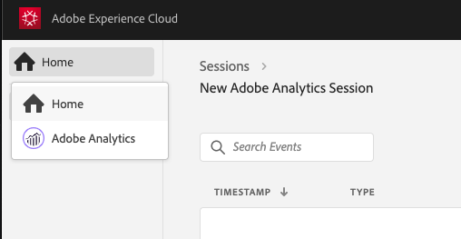

# Adobe Analytics and Project Griffon

The Adobe Analytics view is a focused, yet richer, view of SDK events that are only related to your Adobe Analytics implementation. The view now shows the action/state name and event status with a specifically formatted detail view.

If the SDK made a network request with Adobe Analytics \(queued\), and if post-processing information is returned from Adobe Analytics about that event \(validated\), the status tells you when an SDK event is generated \(processed\).

Generally speaking, for an Analytics track event, the detailed view contains the following valuable pieces:

* An originating SDK Analytics request event.
* OOTB meta and context data from the request, such as report suite ID, SDK extension versions, OOTB context data, and so on.
* Post-processed information on the Analytics event that contains the mapping of revars, evars, props, and so on.

## Using Project Griffon for Adobe Analytics

To get started, complete the following steps:

1. Ensure that you implemented the latest versions of the [Project Griffon](../set-up-project-griffon.md) and [Adobe Analytics](../../../using-mobile-extensions/adobe-analytics/) extensions.
2. Go to [https://experience.adobe.com/griffon](https://experience.adobe.com/griffon) \(and not griffon.adobe.com\).
3. Connect your app to a Project Griffon session.
4. To view your events, select the **Adobe Analytics** view.

