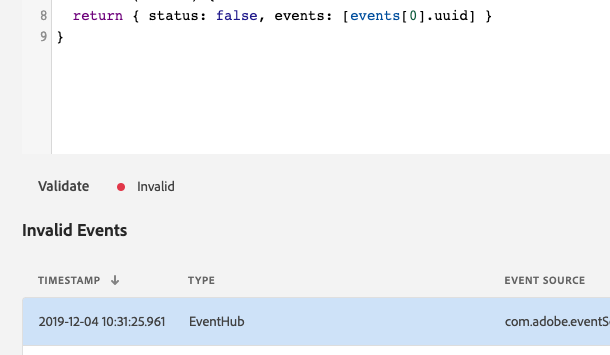

# Custom Validation and Project Griffon
## Overview
The Custom Validation view provides a quick and easy solution to write your own JavaScript function to validate the events in your session.

## Using the Custom Validation View

Follow these steps to get started:

1. Ensure you have implemented the latest version of [Project Griffon](../set-up-project-griffon.md) extension
2. Visit https://experience.adobe.com/griffon \(or griffon.adobe.com\).
3. Connect your app to a Project Griffon session
4. Select the subview Custom Validation \(per the screenshot below\) to view the code editor.

### Writing a Validation Function

The function should expect an array of Project Griffon events and should return a boolean (true or false) or an object that contains a status property and optionally an array of event uuids.

#### Project Griffon Event Definition

| Key | Type | Description |
| :--- | :--- | :--- |
| uuid | String | Universally unique identifier for the event |
| timestamp | Number | Timestamp from the device when the event was sent from the SDK |
| eventNumber | Number | Used to order when the event was sent (useful when events have the same timestamp) |
| vendor | String | Vendor identification string in reverse domain name format (e.g. com.adobe.griffon) |
| type | String | Used to denote the type of event |
| payload | Object | Defines data for the event. Contains both unique and common properties. Some common props found are ACPExtensionEventSource and ACPExtensionEventType |
| annotations | Array | An Array of Annotation objects |

#### Project Griffon Annotation Definition

| Key | Type | Description |
| :--- | :--- | :--- |
| uuid | String | Universally unique identifier for the annotation |
| type | String | Used to denote the type of annotation. Usually the name of the plugin (e.g. analytics) |
| payload | Object | Defines data that should supplement the event. For Adobe Analytics, this is where the post-processed hit data is contained |

#### Returning Validation Results

Clicking validate will execute the code provided in the code editor. The function is allowed to return either a boolean (true or false) or an object that contains a status property and optionally an array of event uuids.

| Key | Type | Description |
| :--- | :--- | :--- |
| status | boolean | Indicates whether the events being evaluated are valid (true) or invalid (false) |
| events | Array | (Optional) An array of event UUIDs. If provided with an invalid status then an event list will display the events in question |

#### Validation Script Management

When the view is first loaded it provides an empty function with JSDoc comments that define how the function accepts the event parameter along with the expected return output. Currently the view provides a way to manage several validation scripts by leveraging the browser's cache. A new validation script can be created by editing the name in the dropdown. The script can then be saved or deleted using the tool buttons next to the "Script Name" field  (per the screenshot below).

#### Troubleshooting

In case of an error in the JavaScript code editor an "ERROR" status will be provided and the reason will be printed to the browser's developer console.

Additionally, reach out to our team on our Slack Channel @ https://projectgriffon.slack.com/
