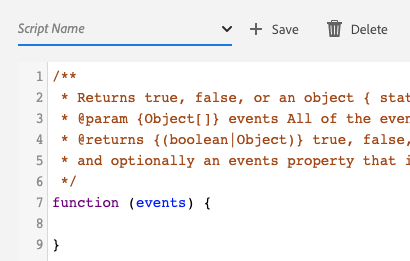

# Custom Validation and Project Griffon

You can use the Custom Validation view to quickly and easily write a JavaScript function and validate the events in your session.

## Using the Custom Validation view

To use the Custom Validation view, complete the following steps:

1. Ensure that you installed and configured the latest version of the Project Griffon extension. For more information, see  [Set up Project Griffon](../set-up-project-griffon.md).
2. Log in to the Griffon UI in one of the following ways:
  * https://experience.adobe.com/griffon
  * https://griffon.adobe.com
3. Connect your app to a Project Griffon session.
4. To view the code editor, select the Custom Validation view.

### Writing a Validation Function

The function should expect an array of Project Griffon events and should return a boolean (true or false) or an object that contains a status property and optionally an array of event uuids.

#### Project Griffon event definition

| Key | Type | Description |
| :--- | :--- | :--- |
| uuid | String | Universally unique identifier for the event. |
| timestamp | Number | Timestamp from the device when the event was sent from the SDK. |
| eventNumber | Number | Used to order when the event was sent. This key is useful when events have the same timestamp. |
| vendor | String | Vendor identification string in the reverse domain name format (for example, com.adobe.griffon). |
| type | String | Used to denote the type of event. |
| payload | Object | Defines the data for the event and contains unique and common properties. Some common properties include ACPExtensionEventSource and ACPExtensionEventType. |
| annotations | Array | An array of annotation objects. |

#### Project Griffon annotation definition

| Key | Type | Description |
| :--- | :--- | :--- |
| uuid | String | Universally unique identifier for the annotation. |
| type | String | Used to denote the type of annotation and is usually the name of the plugin (for example, analytics). |
| payload | Object | Defines the data that should supplement the event. For Adobe Analytics, this is where the post-processed hit data is contained. |

#### Returning validation results

To execute the code in the code editor, click Validate . The function should return a boolean (true or false) or an object that contains a status property and optionally an array of event UUIDs.

| Key | Type | Description |
| :--- | :--- | :--- |
| status | boolean | Indicates whether the events being evaluated are valid (true) or invalid (false). |
| events | Array | (Optional) An array of event UUIDs. If provided with an invalid status, an event list displays the relevant events. |

#### Validation Script Management

When the view is first loaded, it provides an empty function with JSDoc comments that define how the function accepts the events parameter with the expected return output. Currently, the view allows you to manage several validation scripts by leveraging the browser's cache.

You can create a new validation script by editing the existing script’s name in the drop-down list. To save or delete the script, click the appropriate button next to the Script Name field.

#### Troubleshooting

If an error occurs in the JavaScript code editor, an ERROR status is displayed , and the reason for the error is output to the browser's developer console.

Additionally, you can also reach out to our team on our Slack Channel @ https://projectgriffon.slack.com/
