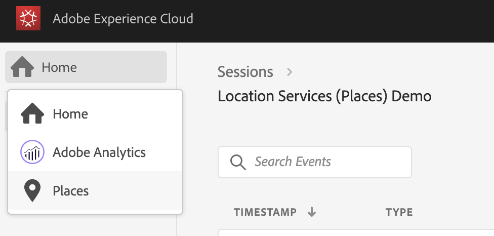

# Places Service and Project Griffon

The **Places** views allow you to inspect location entry and exit events on the Project Griffon web UI and provides an innovative on-device view. Depending on your business workflows, these handy views provide a convenient interface to display location-specific data points for inspection on the web/client for in-context debugging.

We know that using location context with your app experiences can make them more engaging. However, debugging and validating location triggers can be painful. Using these views and reviewing the data that you collect on the device helps alleviate that pain.

## Using Project Griffon for Places Service

To get started, complete the following steps:

1. Ensure that you implemented the latest versions of the [Project Griffon](../set-up-project-griffon.md) and [Places Service](location-service-and-project-griffon.md) extensions.
2. Go to [https://experience.adobe.com/griffon](https://experience.adobe.com/griffon) \(**not** griffon.adobe.com\).
3. Connect your app to a Project Griffon session. For more information, see [Start a Project Griffon session](%20https://app.gitbook.com/@aep-sdks/s/docs/beta/project-griffon/set-up-project-griffon#start-a-project-griffon-session). 
4. To view your events, select the **Places** view.

