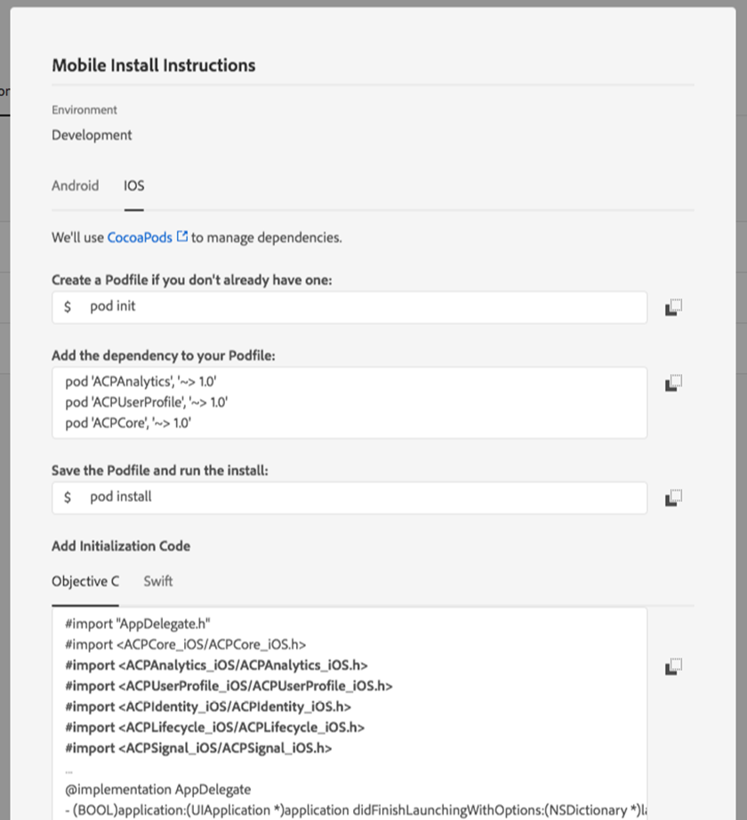

# Get the Experience Platform SDK

The Adobe Experience Platform SDK is available for iOS via [Cocoapods](https://cocoapods.org/), Android via [Gradle](https://gradle.org), and for React Native projects via [Node Package Manager](https://nodejs.org).

Follow the directions below to incorporate the SDK into your mobile application.


For iOS and Android projects, the recommended approach to integrating the SDK is to use Cocoapods, Gradle, and/or npmjs. SDK libraries are also available on [Github](https://github.com/Adobe-Marketing-Cloud/acp-sdks/).




### Java


The Experience Platform SDK for Android supports Android 4.0 \(API 14\) or later.


1. Open a previously created and configured **Mobile** property in Experience Platform Launch, and click on the **Environments** tab, and then click on the install package icon.
2. On the **Mobile Install Instructions** dialog box, select **Android**.
3. Follow the instructions for using Gradle with Android.

The necessary dependencies and initialization code can be copied from the dialog box to your app project.

You should see a dialog box similar to the following:




### Objective C / Swift


**Important:** Adobe Experience Platform SDKs for iOS supports **iOS 10 or later.**


1. Open a previously created and configured **Mobile** property in Launch, and click on the **Environments** tab, and then click on the install package icon   
2. On the **Mobile Install Instructions** dialog box, select **iOS**.
3. Follow the instructions for using CocoaPods with iOS.
4. Under the initialization code, choose Objective C or Swift.

The necessary dependencies and initialization code can be copied from the dialog box to your app project.

You should see a pop-up similar to the following \(image below shows iOS\):




### React Native


For React Native, we recommend that you first install [Node.js](https://nodejs.org) to download packages from [npm](https://npmjs.com). For additional instructions on getting started with React Native applications, see this [tutorial](https://facebook.github.io/react-native/docs/getting-started).


For the latest React Native installation instructions, see the README file in the [react-native-acpcore](https://github.com/adobe/react-native-acpcore) repository.



## Watch the Video



## Additional Information

* [How to use Gradle for Android](https://docs.gradle.org/current/userguide/userguide.html)
* [How to use CocoaPods for iOS ](https://guides.cocoapods.org/using/using-cocoapods)
* [Current SDK Versions](../resources/frequently-asked-questions/current-sdk-versions.md)

## Get help

* Visit the SDK [community forum](https://forums.adobe.com/community/experience-cloud/platform/launch/sdk) to ask questions
* Contact [Adobe Experience Cloud customer care](https://helpx.adobe.com/contact/enterprise-support.ec.html) for immediate assistance

