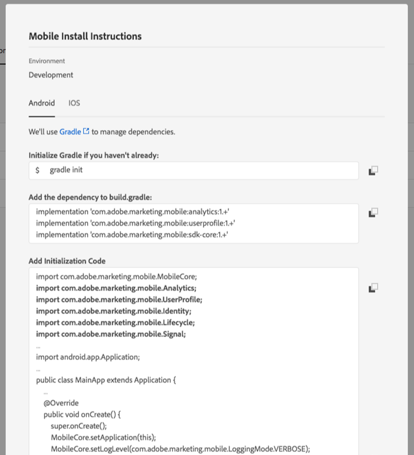

# Get the Experience Platform SDK

The Adobe Experience Platform SDK is available for iOS via [Cocoapods](https://cocoapods.org/), Android via [Gradle](https://gradle.org), and for React Native projects via [Node Package Manager](https://nodejs.org).

Follow the directions below to include the SDK into your mobile application.


For iOS and Android projects, the recommended approach to integrating the SDK is to use Cocoapods, Gradle, and/or npmjs. SDK libraries are also available on [Github](https://github.com/Adobe-Marketing-Cloud/acp-sdks/).




### Java


The Experience Platform SDK for Android supports Android 4.0 \(API 14\) or later.


1. Open the mobile property you created earlier in Experience Platform.
2. On your property's details page, click on the **Environments** tab.

   The **Environments** tab lists the different environments that you can publish. 
   
2. In the row for the **Development** environment, click on the install package icon (.

   You should see a dialog box similar to the following:

   
   
3. On the **Mobile Install Instructions** dialog box, select the **Android** tab.
4. Follow the instructions for using Gradle with Android.

    The necessary dependencies and initialization code can be copied from the dialog box to your app project.




### Objective C / Swift


**Important:** Adobe Experience Platform SDKs for iOS supports **iOS 10 or later.**


1. Open a previously created and configured **Mobile** property in Launch, and click on the **Environments** tab, and then click on the install package icon  (). 
2. On the **Mobile Install Instructions** dialog box, select **iOS**.
3. Follow the instructions for using CocoaPods with iOS.
4. Under the initialization code, choose Objective C or Swift.

The necessary dependencies and initialization code can be copied from the dialog box to your app project.

You should see a pop-up similar to the following \(image below shows iOS\):





### React Native


For React Native, we recommend that you first install [Node.js](https://nodejs.org) to download packages from [npm](https://npmjs.com). For additional instructions on getting started with React Native applications, see this [tutorial](https://facebook.github.io/react-native/docs/getting-started).


For the latest React Native installation instructions, see the README file in the [react-native-acpcore](https://github.com/adobe/react-native-acpcore) repository.



## Manual installation

If you cannot access the installation dialog box, complete the following sections to get the Mobile SDKs. 

### Configure the SDK with an Environment ID

To initialize the SDK, you will need to first configure the SDK with an **Environment ID** from Adobe Experience Platform Launch. The **Environment ID** links the configuration from a mobile property with your SDK implementation.


To find your Environment ID for an environment, in Experience Platform Launch, go to the **Environments** tab \(found in a previously created and configured mobile property\) and click on the correspondingicon.




#### Java

1. In the app, create `MainActivity.java` .
2. Add `MobileCore.configureWithAppID("PASTE_ENVIRONMENT_ID_HERE");`



#### Objective-C

In Xcode, find your `didFinishLaunchingWithOptions` in `AppDelegate.m` and add:

```objectivec
[ACPCore configureWithAppId:@"PASTE_ENVIRONMENT_ID_HERE"];
```

#### Swift

In Xcode, find your `didFinishLaunchingWithOptions` in AppDelegate.swift and add:

```swift
ACPCore.configure(withAppId: "PASTE_ENVIRONMENT_ID_HERE")
```



### Initializing the SDK



#### Java

```jsx
@Override
public void onCreate() {
  //...
  MobileCore.setApplication(this);
  MobileCore.configureWithAppID("PASTE_ENVIRONMENT_ID_HERE");

  try {
    Identity.registerExtension();
    Lifecycle.registerExtension();
    Signal.registerExtension();
  } catch (Exception e) {
    // handle exception
  }

  MobileCore.start(null);
}
```



#### Objective C

```jsx
// Import the SDK
#import "ACPCore.h"
#import "ACPLifecycle.h"
#import "ACPIdentity.h"
#import "ACPSignal.h"

- (BOOL)application:(UIApplication *)application didFinishLaunchingWithOptions:(NSDictionary *)launchOptions {
  //...
  [ACPCore configureWithAppId:@"PASTE_ENVIRONMENT_ID_HERE"];
  [ACPIdentity registerExtension];
  [ACPLifecycle registerExtension];
  [ACPSignal registerExtension];

  [ACPCore start:nil];
}
```



#### Javascript

> Tip: We recommend that you initialize the SDK by using native code in your `AppDelegate` and `MainApplication` in iOS and Android, respectively. You can also initialize the SDK in Javascript \([React Native](https://github.com/adobe/react-native-acpcore)\).

```jsx
import {ACPCore, ACPLifecycle, ACPIdentity, ACPSignal, ACPMobileLogLevel} from '@adobe/react-native-acpcore';

initSDK() {
    ACPCore.setLogLevel(ACPMobileLogLevel.VERBOSE);
    ACPCore.configureWithAppId("PASTE_ENVIRONMENT_ID_HERE");
    ACPLifecycle.registerExtension();
    ACPIdentity.registerExtension();
    ACPSignal.registerExtension();
    ACPCore.start();
}
```



### Ensure app permissions \(Android\)

The SDK requires standard [network connection](https://developer.android.com/training/basics/network-ops/connecting) permissions in your manifest to send data, collect cellular provider, and record offline tracking calls.

To enable these permissions, add the following lines to your `AndroidManifest.xml` file, located in your app's application project directory:

```markup
<uses-permission android:name="android.permission.INTERNET" />
<uses-permission android:name="android.permission.ACCESS_NETWORK_STATE" />
```

## Watch the Video



## Additional Information

* [How to use Gradle for Android](https://docs.gradle.org/current/userguide/userguide.html)
* [How to use CocoaPods for iOS ](https://guides.cocoapods.org/using/using-cocoapods)
* [Current SDK Versions](../resources/frequently-asked-questions/current-sdk-versions.md)

## Get help

* Visit the SDK [community forum](https://forums.adobe.com/community/experience-cloud/platform/launch/sdk) to ask questions
* Contact [Adobe Experience Cloud customer care](https://helpx.adobe.com/contact/enterprise-support.ec.html) for immediate assistance

