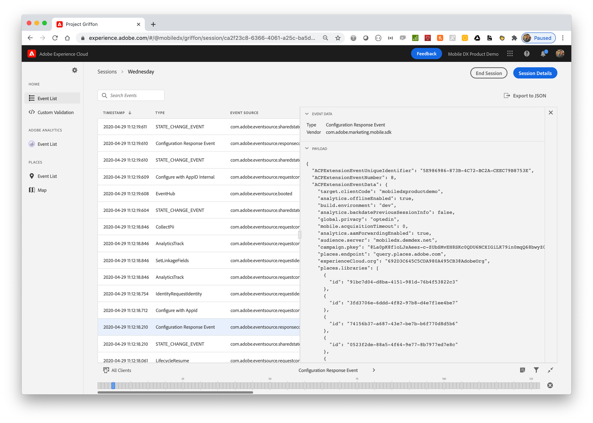

# Validation

As you begin to add solution APIs to your mobile implementation, you are going to want to validate that specific actions and experiences work as intended. Adding [Project Griffon](https://aep-sdks.gitbook.io/docs/beta/project-griffon#what-can-project-griffon-do-for-you) to your application at the beginning of your implementation provides a way to quickly check to make sure the SDK has been instrumented properly and that data is flowing to [Adobe Experience Platform Edge Network](https://www.adobe.com/experience-platform/experience-platform-edge-network.html).

Project Griffon is available across all [SDK platforms and frameworks](https://aep-sdks.gitbook.io/docs/resources/upgrading-to-aep/current-sdk-versions). Installation and setup instructions are available [here](https://aep-sdks.gitbook.io/docs/beta/project-griffon#quick-setup).

Once you have Griffon integrated, you can create a [new session](https://aep-sdks.gitbook.io/docs/beta/project-griffon/using-project-griffon#creating-sessions) either by scanning a QR code, or by following a unique deep link URL.

The main interface for Griffon will show a running event list of all SDK events, including a configuration response event that will provide a readout of all configuration values obtained from Adobe Experience Platform Launch.

To learn more about Project Griffon see: [Project Griffon setup](https://aep-sdks.gitbook.io/docs/beta/project-griffon/set-up-project-griffon)

