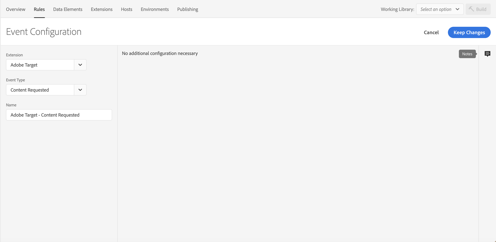
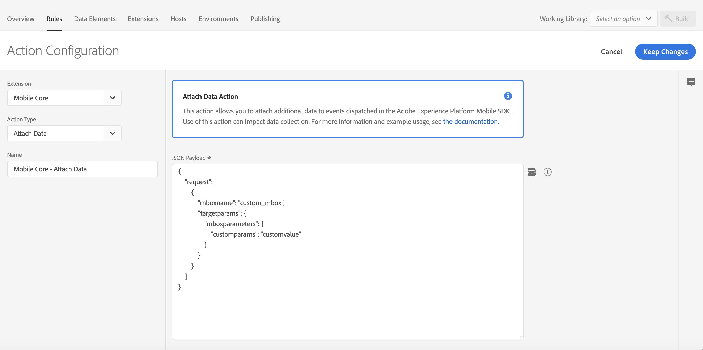
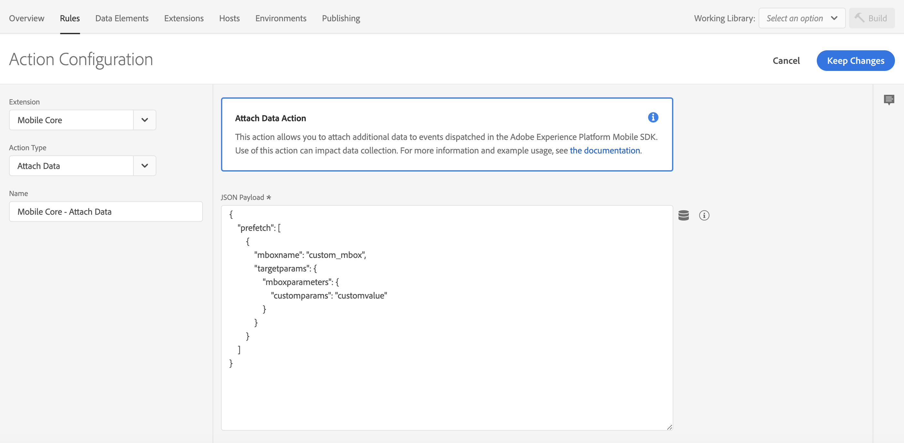
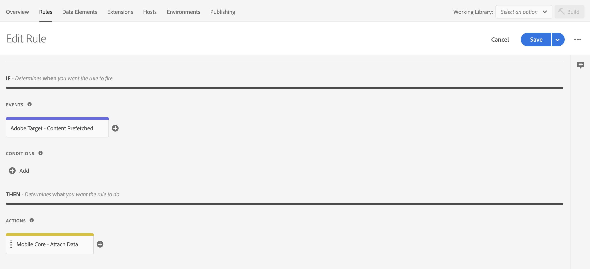
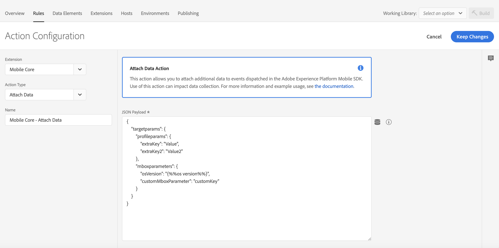
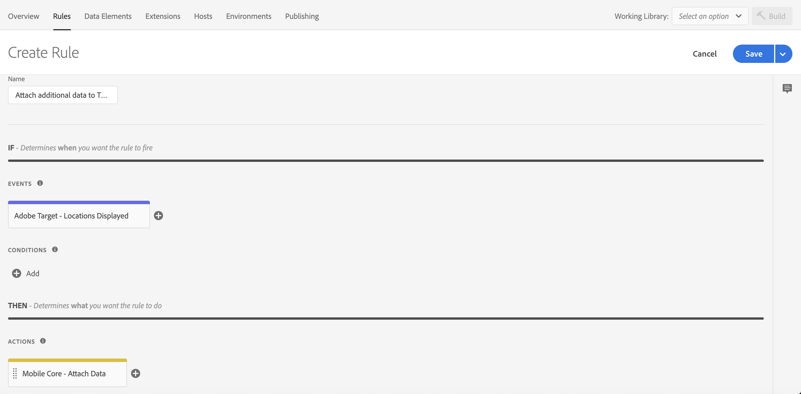

# Attach Data to SDK Events

The _attach data_ rule action is supported in [Mobile Core](../../using-mobile-extensions/mobile-core/) starting version 2.1.8 \(Launch\), 2.3.5 \(iOS\), and 1.4.5 \(Android\). This action is powerful, complex, and enables advanced use cases.

To use this action, we need to provide context about how events flow in the Adobe Experience Platform Mobile SDK and how they interact with the SDK's [rules engine](../../using-mobile-extensions/mobile-core/rules-engine/). Next, you will learn how to use the action with relevant examples.

## Context

### What are SDK events?

In the Experience Platform Mobile SDK, events hold all the data that is required by other extensions to complete the necessary actions. Events have the following properties:

| Property | Description |
| :--- | :--- |
| Type | Describes the event. Examples include Analytics, Target, Lifecycle, and so on. |
| Source | Indicates the cause of or directionality of the event. For example, a request or a response. |
| Event data | Additional data is required to define the event. For example, context data on an Analytics event. |

Extensions that register with [Mobile Core](../../using-mobile-extensions/mobile-core/) will also register event listeners. A listener is defined by an event _type_ and _source_ combination. When the SDK event hub processes an event, it notifies all listeners that match the provided combination.

### How are events created in the SDK?

Events are created by an extension and are dispatched to the SDK Event Hub. Each published rule that is created in Adobe Experience Platform Launch is evaluated against the current event. Finally, the event is passed to each of the listeners for events with this _type_ /_source_ combination.


Events are created and dispatched when an SDK public API is invoked. Attach data action use cases are meant to act on these types of events.


### What is the Rules Engine?

The Rules Engine lives in the SDK Event Hub. Before listeners are notified, the Rules Engine evaluates each Experience Platform Launch rule against the triggering event. A rule is defined by the following properties:

| Property | Description |
| :--- | :--- |
| Event | Trigger for the rule. |
| Condition | Definition of the criteria to compare against the triggering event. |
| Action | The resulting action if the evaluation of the rule is positive. |


A rule might be read out in the following way: _If_ SDK _**Event** occurs_ and _**Condition\(s\)**_ are met, then perform the _**Action\(s\)**._


## Using the attach data action

Attach Data is a type of Rule Action that allows you to add event data to an SDK event. The modification of data happens in the Rules Engine before event listeners are notified of the event.


Attach Data Rule Actions will only add data to the event, and the actions never modify or remove data.

If there is a conflict between the data that is defined in your Rule and the data in the Event, the data in the event always has preference.


### Defining a payload for the attach data action

When defining a payload for the attach data action, the payload must match the format of the triggering event. For example, if you want to add context data to an Analytics event, you need to know where the context data is defined on that event and match the format in your rule. For this reason, we strongly recommended that you enable verbose logging in the SDK and carefully study the format of the event to which you will attach the data. If the format does not match, most likely the expected results will not be received.

## Example - attaching data to an event




The following sample shows how to _attach data_ to all outgoing `TrackAction` Analytics network requests. To create this type of rule, select your property in Experience Platform Launch and complete the following steps:

1. [Create a new **Rule**](#analytics-create-rule)
2. [Select the **Event** you want to trigger the rule](#analytics-select-an-event)
3. [Select the **Action** to attach data and define your payload](#analytics-define-the-action)
4. [Save and rebuild the property](#analytics-save-the-rule-and-rebuild-your-property)

### Create a rule<a name="analytics-create-rule"> </a>

1. On the **Rules** tab, click **Create New Rule**.


If you do not have existing rules for this property, the **Create New Rule** button will be in the middle of the screen. If your property has rules, the button will be in the top right of the screen.


### Select an event<a name="analytics-select-an-event"></a>

1. Give your rule an easily recognizable name in your list of rules.

   In this example, the rule is named **Attach Places Data to Analytics Track Action Events**.

2. Under the **Events** section, click **Add**.
3. From the **Extension** drop-down list, select **Mobile Core**.
4. From the **Event Type** drop-down list, select **Track Action**.
5. Click **Keep Changes**.


### Define the action<a name="analytics-define-the-action"></a>

1. Under the **Actions** section, click **Add**.
2. From the **Extension** drop-down list, select **Mobile Core**.
3. From the **Action Type** drop-down list, select **Attach Data**.
4. On the right pane, in the **JSON Payload** field, type the data that will be added to this event.
5. Click **Keep Changes**.

On the right pane, you can add a freeform JSON payload that adds data to an SDK event before an extension that is listening for this event can hear the event. In this example, some context data is added to this event before the Analytics extension processes it. The added context data will now be on the outgoing Analytics hit.

In the following example, **launches** and **anAddedKey** keys are added to the **contextdata** of the Analytics event. Values for the new keys can either be hardcoded in the rule, or dynamically determined by the SDK when this event processes by using Data Elements.


### Save the rule and rebuild your property<a name="analytics-save-the-rule-and-rebuild-your-property"></a>

After you complete your configuration, verify that your rule looks like the following:


1. Click **Save**
2. Rebuild your Launch property and deploy it to the correct Environment.





### How to attach additional profile parameters to Target retrieve location events

The following sample shows how to _attach data_ to all outgoing `retrieveLocationContent` Target network requests. To create this type of rule, select your property in Experience Platform Launch and complete the following steps:

1. [Create a new **Rule**](#target-create-rule)
2. [Select the **Event** you want to trigger the rule](#target-select-an-event)
3. [Select the **Action** to attach data and define your payload](#target-define-the-action)
4. [Save and rebuild the property](#target-save-the-rule-and-rebuild-your-property)

### Create a rule<a name="target-create-rule"> </a>

1. On the **Rules** tab, click **Create New Rule**.


If you do not have existing rules for this property, the **Create New Rule** button will be in the middle of the screen. If your property has rules, the button will be in the top right of the screen.


### Select an event<a name="target-select-an-event"> </a>

1. Give your rule an easily recognizable name in your list of rules.

   In this example, the rule is named **Attach additional data to Target retrieve location Events**.

2. Under the **Events** section, click **Add**.

3. From the **Extension** drop-down list, select **Adobe Target**.

4. From the **Event Type** drop-down list, select **Content Requested**.

5. Click **Keep Changes**.



### Define the action<a name="target-define-the-action"> </a>

1. Under the **Actions** section, click **Add**.
2. From the **Extension** drop-down list, select **Mobile Core**.
3. From the **Action Type** drop-down list, select **Attach Data**.
4. On the right pane, in the **JSON Payload** field, type the data that will be added to this event.
5. Click **Keep Changes**.

On the right pane, you can add a freeform JSON payload that adds data to an SDK event before an extension that is listening for this event can hear the event. In this example, additional profile parameters are added to this event before the Target extension processes it. The added profile parameters will now be added on outgoing Target retrieve location content requests.

In the following example, **extraKey**, **extraKey2**, and a data element defined for the **OS version** are added to the profile parameters of the Target event. Values for the new keys can either be hardcoded in the rule, or dynamically determined by the SDK when this event processes by using Data Elements.



The following example shows how the data element for OS version was created.


In addition to being able to add custom profile parameters to each Target retrieve location request, custom mboxes can be added as well. The following example contains a valid JSON payload for this use case:

```json
{
    "request": [
        {
            "mboxname": "custom_mbox"
        }
    ]
}
```

### Save the rule and rebuild your property<a name="target-save-the-rule-and-rebuild-your-property"> </a>

After you complete your configuration, verify that your rule looks like the following:


1. Click **Save**
2. Rebuild your Launch property and deploy it to the correct Environment.

### How to attach additional Target prefetch objects to Target prefetch request events

The following sample shows how to add a custom mbox to prefetch in all outgoing `prefetchContent` Target network requests. To create this type of rule, select your property in Experience Platform Launch and complete the following steps:

1. [Create a new **Rule**](#target-create-rule-prefetch)
2. [Select the **Event** you want to trigger the rule](#target-select-an-event-prefetch)
3. [Select the **Action** to attach data and define your payload](#target-define-the-action-prefetch)
4. [Save and rebuild the property](#target-save-the-rule-and-rebuild-your-property-prefetch)

### Create a rule<a name="target-create-rule-prefetch"> </a>

1. On the **Rules** tab, click **Create New Rule**.


If you do not have existing rules for this property, the **Create New Rule** button will be in the middle of the screen. If your property has rules, the button will be in the top right of the screen.


### Select an event<a name="target-select-an-event-prefetch"> </a>

1. Give your rule an easily recognizable name in your list of rules.

   In this example, the rule is named **Attach additional data to Target prefetch content Events**.

2. Under the **Events** section, click **Add**.

3. From the **Extension** drop-down list, select **Adobe Target**.

4. From the **Event Type** drop-down list, select **Content Prefetched**.

5. Click **Keep Changes**.


### Define the action<a name="target-define-the-action-prefetch"> </a>

1. Under the **Actions** section, click **Add**.
2. From the **Extension** drop-down list, select **Mobile Core**.
3. From the **Action Type** drop-down list, select **Attach Data**.
4. On the right pane, in the **JSON Payload** field, type the data that will be added to this event.
5. Click **Keep Changes**.

On the right pane, you can add a freeform JSON payload that adds data to an SDK event before an extension that is listening for this event can hear the event. In this example, a custom mbox is added to the event before the Target extension processes it. The added custom mbox will now be added on outgoing Target prefetch requests.

In the following example, an mbox named **custom_mbox** with an additional mbox parameter named **customparams** is added to the Target event.



### Save the rule and rebuild your property<a name="target-save-the-rule-and-rebuild-your-property-prefetch"> </a>

After you complete your configuration, verify that your rule looks like the following:



1. Click **Save**
2. Rebuild your Launch property and deploy it to the correct Environment.

### How to attach additional mbox and profile parameters to Target location clicked events

The following sample shows how to add additional mbox and profile parameters in all outgoing `locationClicked` Target network requests. To create this type of rule, select your property in Experience Platform Launch and complete the following steps:

1. [Create a new **Rule**](#target-create-rule-clicked)
2. [Select the **Event** you want to trigger the rule](#target-select-an-event-clicked)
3. [Select the **Action** to attach data and define your payload](#target-define-the-action-clicked)
4. [Save and rebuild the property](#target-save-the-rule-and-rebuild-your-property-clicked)

### Create a rule<a name="target-create-rule-clicked"> </a>

1. On the **Rules** tab, click **Create New Rule**.


If you do not have existing rules for this property, the **Create New Rule** button will be in the middle of the screen. If your property has rules, the button will be in the top right of the screen.


### Select an event<a name="target-select-an-event-clicked"> </a>

1. Give your rule an easily recognizable name in your list of rules.

   In this example, the rule is named **Attach additional data to Target location clicked Events**.

2. Under the **Events** section, click **Add**.

3. From the **Extension** drop-down list, select **Adobe Target**.

4. From the **Event Type** drop-down list, select **Location Clicked**.

5. Click **Keep Changes**.


### Define the action<a name="target-define-the-action-clicked"> </a>

1. Under the **Actions** section, click **Add**.
2. From the **Extension** drop-down list, select **Mobile Core**.
3. From the **Action Type** drop-down list, select **Attach Data**.
4. On the right pane, in the **JSON Payload** field, type the data that will be added to this event.
5. Click **Keep Changes**.

On the right pane, you can add a freeform JSON payload that adds data to an SDK event before an extension that is listening for this event can hear the event. In this example, custom mbox and profile parameters are added to the event before the Target extension processes it. The added mbox and profile parameters will now be added on outgoing Target location clicked requests.

In the following example, **extraKey**, **extraKey2**, and a data element defined for the **OS version** are added to the profile parameters of the Target event. A key named **customMboxParameter** is added to the mbox parameters of the Target event. Values for the new keys can either be hardcoded in the rule, or dynamically determined by the SDK when this event processes by using Data Elements.


### Save the rule and rebuild your property<a name="target-save-the-rule-and-rebuild-your-property-clicked"> </a>

After you complete your configuration, verify that your rule looks like the following:


1. Click **Save**
2. Rebuild your Launch property and deploy it to the correct Environment.

### How to attach additional mbox and profile parameters to Target location displayed events

The following sample shows how to add additional mbox and profile parameters in all outgoing `locationDisplayed` Target network requests. To create this type of rule, select your property in Experience Platform Launch and complete the following steps:

1. [Create a new **Rule**](#target-create-rule-displayed)
2. [Select the **Event** you want to trigger the rule](#target-select-an-event-displayed)
3. [Select the **Action** to attach data and define your payload](#target-define-the-action-displayed)
4. [Save and rebuild the property](#target-save-the-rule-and-rebuild-your-property-displayed)

### Create a rule<a name="target-create-rule-displayed"> </a>

1. On the **Rules** tab, click **Create New Rule**.


If you do not have existing rules for this property, the **Create New Rule** button will be in the middle of the screen. If your property has rules, the button will be in the top right of the screen.


### Select an event<a name="target-select-an-event-displayed"> </a>

1. Give your rule an easily recognizable name in your list of rules.

   In this example, the rule is named **Attach additional data to Target location displayed Events**.

2. Under the **Events** section, click **Add**.

3. From the **Extension** drop-down list, select **Adobe Target**.

4. From the **Event Type** drop-down list, select **Location Displayed**.

5. Click **Keep Changes**.


### Define the action<a name="target-define-the-action-displayed"> </a>

1. Under the **Actions** section, click **Add**.
2. From the **Extension** drop-down list, select **Mobile Core**.
3. From the **Action Type** drop-down list, select **Attach Data**.
4. On the right pane, in the **JSON Payload** field, type the data that will be added to this event.
5. Click **Keep Changes**.

On the right pane, you can add a freeform JSON payload that adds data to an SDK event before an extension that is listening for this event can hear the event. In this example, custom mbox and profile parameters are added to the event before the Target extension processes it. The added mbox and profile parameters will now be added on outgoing Target location displayed requests.

In the following example, **extraKey**, **extraKey2**, and a data element defined for the **OS version** are added to the profile parameters of the Target event. A key named **customMboxParameter** is added to the mbox paramters of the Target event. Values for the new keys can either be hardcoded in the rule, or dynamically determined by the SDK when this event processes by using Data Elements.



### Save the rule and rebuild your property<a name="target-save-the-rule-and-rebuild-your-property-displayed"> </a>

After you complete your configuration, verify that your rule looks like the following:



1. Click **Save**
2. Rebuild your Launch property and deploy it to the correct Environment.



