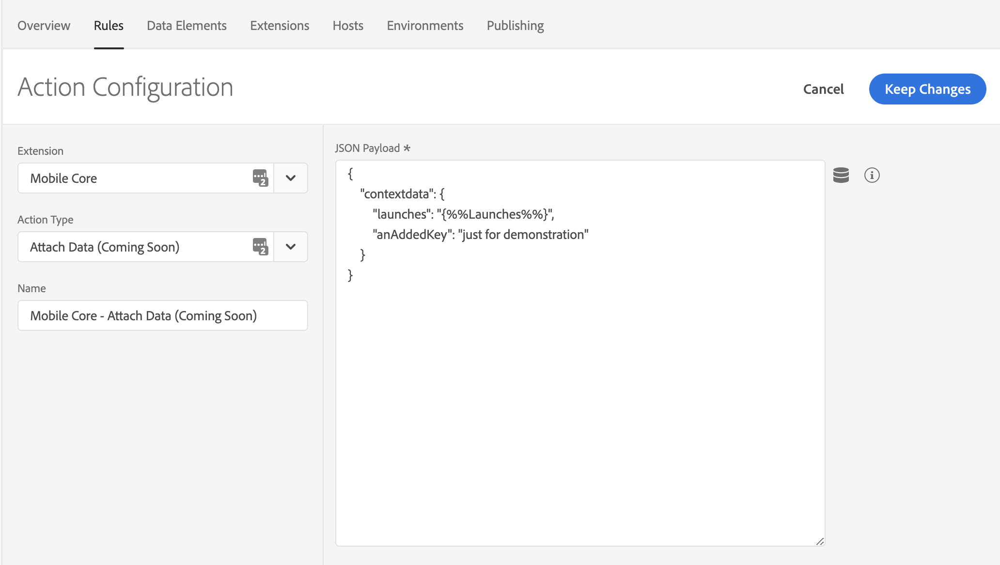

# Using the Attach Data Rules Action

The Attach Data rule action was added in the `Mobile Core v2.1.8` Launch extension. This rule is powerful and complex and is recommended for users with advanced use cases.

To understand how to use Attach Data, you need foundational knowledge about how Events flow in the SDK and the role of the SDK's Rules Engine.

This document provides the information necessary to understand how to use Attach Data and provides an example of how to use it.

## SDK Events

### What is an Event?

In the SDK, Events hold all of the data that is required by other SDK extensions to complete their necessary actions.

Events have the following defining properties:

* `type` - describes what kind of Event this is. For example, **Analytics**, **Target**, or **Lifecycle**.
* `source` - indicates the cause of the Event that is primarily used to indicate the directionality of the Event. For example, **request** or **response**.
* `event data` - any additional data needed to fully define the Event. For example, context data on an Analytics event.

Extensions that register with the SDK will also register Event listeners. A listener is defined by an Event `type` and `source` combination. When the `event hub` processes an Event, it notifies all listeners that match its combination.

### When are Events created in the SDK

Events are created by an extension and are then dispatched to the `event hub` in the SDK's core. Each of the Rules created in Adobe Launch are then evaluated against the current Event. Finally, the Event is passed to each of the listeners for Events with this `type/source` combination.


When you invoke any of the SDK's public APIs, an Event is created and dispatched. Attach Data use cases usually focus on these types of Events.


## SDK Rules Engine

The Rules Engine lives in the `event hub` and, before listeners are notified, evaluates each Rule that is created in Launch against the triggering Event. A Rule is defined by three components:

* `Event` - this is the trigger for the Rule.
* `Condition` - a definition of criteria to compare against the triggering Event.
* `Action` - what should happen if evaluation of the Rule is positive.

A rule can be read out loud like this:

_If `Event` occurs, and `Condition(s)` are met, then do `Action`._

## What is Attach Data?

Attach Data is a type of Rule Action that allows you to add Event Data to an SDK Event. The modification of data happens in the Rules Engine before Event listeners are notified of the Event.


Attach Data Rule Actions will only add data to the Event, and they will never modify or remove data.

If there is a conflict between the data that is defined in your Rule and the data in the Event, the data in the Event will always have preference.


### Defining a payload for Attach Data

When defining a payload for Attach Data, the payload must match the format of the triggering Event. For example, if you want to add context data to an Analytics event, you need to know where the context data is defined on that event and match the format in your rule. For this reason, it is strongly recommended that you enable verbose logging in the SDK and carefully study the format of the event to which you attach data. If the format does not match, it is unlikely that the expected results will be received.

## An example of attaching data to an Analytics Event

The following sample shows how to attach data to all outgoing `TrackAction` Analytics calls. To create this type of rule, select your property in Launch and complete the following steps:

1. [Create a new **Rule**](attach-data.md#create-a-rule)
2. [Select the **Event** you wish to trigger the rule](attach-data.md#select-an-event)
3. [Select the **Action** to Attach Data and define your payload](attach-data.md#define-the-action)

### Create a Rule

1. On the **Rules** tab, click **Create New Rule**.

Remember the following information:

* If you do not have existing rules for this property, the button will be in the middle of the screen.
* If your property has rules, the button will be in the top right of the screen.

### Select an Event

1. Give your Rule a meaningful name so it will be easily recognizable in your list of Rules. In this example, the Rule is named **Attach Places Data to Analytics Track Action Events**.
2. Under the **Events** section, click **Add**.
3. From the **Extension** drop-down list, select **Mobile Core**.
4. From the **Event Type** drop-down list, select **Track Action**.
5. Click **Keep Changes**.

### Define the Action

1. Under the **Actions** section, click **Add**.
2. From the **Extension** drop-down list, select **Mobile Core**.
3. From the **Action Type** drop-down list, select **Attach Data**.
4. On the right pane, in the **JSON Payload** field, type the data that will be added to this Event.
5. Click **Keep Changes**.

On the right pane, you can add a freeform JSON payload that adds data to an SDK event before an extension that is listening for this event can hear the event. In this example, some context data is added to this event before the Analytics extension processes it. The added context data will now be on the outgoing Analytics hit.

In the following example, **launches** and **anAddedKey** keys are added to the **contextdata** of the Analytics event. Values for the new keys can either be hardcoded in the Rule, or dynamically determined by the SDK when this event processes by using Data Elements.

### Save the Rule and rebuild your property

After you complete your configuration, verify that your Rule looks like the following image:

1. Click **Save**
2. Rebuild your Launch property and deploy it to the correct Environment.

