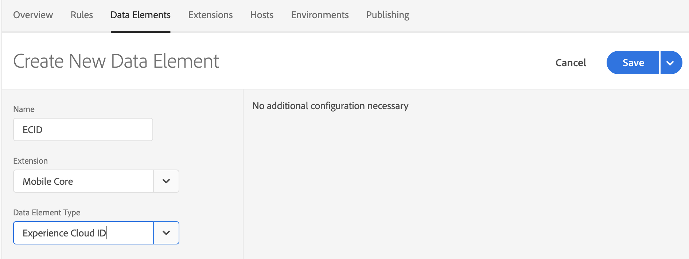
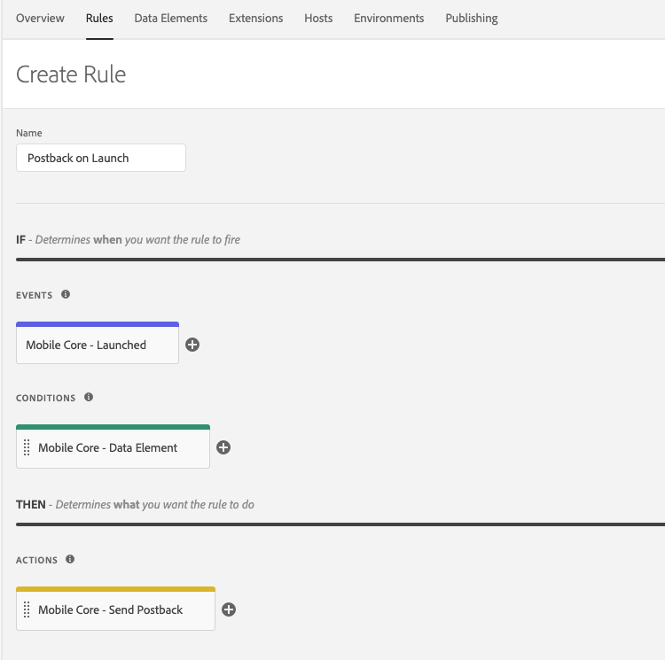

# Data Elements

Data elements are the building blocks for your data dictionary and are used to collect, organize, and deliver data across marketing and ad technology.

A data element is a variable where the value can be mapped to data within the Experience Platform Mobile SDK such as visitor ID, device name, user profile, number of launches, et cetera. In Experience Platform Launch you can reference this value by its variable name. This collection of data elements becomes the dictionary of defined data that you can use to build rules for your application, and this dictionary is shared across Experience Platform Launch where it can be used with any extension added to your property.

Use data elements as widely as possible throughout rule creation to consolidate the definition of dynamic data. You define data elements once, and use them in multiple places. The concept of reusable data elements if very powerful and you should use them as a best practice.

Data elements are populated with data when they are processed within the Experience Platform Mobile SDK [Rules Engine](https://aep-sdks.gitbook.io/docs/using-mobile-extensions/mobile-core/rules-engine). To use data elements, at a high level:

1. Create a data element.
2. Use the data element when defining a rule.
3. [Publish](https://docs.adobe.com/content/help/en/launch/using/reference/publish/overview.html) your property, which publishes the rules JSON and make it available for download by your applications.

## Create a data element

Data elements are building blocks for rules. Data elements let you create a data dictionary of commonly used data in the Experience Platform Mobile SDK, regardless of where they originate (shared state, event data) or which extension creates them.

1. From a Property page, open the Data Elements tab, then click Add Data Element.

2. Give a unique, descriptive name to the data element.

3. Select the Extension which generates the data element type. 

   You may only select Extensions which are currently installed in your property.

4. Select the Data Element Type. 

   Add the required configuration parameters. Most data element types do not require any configuration.

5. Click Save.

For example, to create a data element which maps to the Experience Cloud ID, from the Create New Data Element page, select Extension *Mobile Core*, Data Element Type *Experience Cloud ID* and enter Name *ECID*. 

## Data Element Usage

You can use data elements when defining rules in the Experience Platform Launch interface. When a rule configuration allows the use of data elements, a cylinder icon  is displayed next to the configuration text field. Clicking the icon gives a list of data elements defined in the mobile property.

Here is an example which creates a rule to send a postback containing the Experience Cloud ID when the application launches.

1. From a Property page, open the Rules tab, then click Create New Rule.

   

2. Give a unique, descriptive name to the rule.

3. Add an Event configuration. 

   Select Extension *Mobile Core* and Event Type *Launched*.

   

4. Add a Condition configuration. 

   Select Extension *Mobile Core* and Condition Type *Data Element*. Select the cylinder icon  next to the "Data element" text field, then select the ECID data element we created above. Select *exists* as the condition.

   

5. Add an Action configuration. 

   Select Extension *Mobile Core* and Action Type *Send Postback*. In the "URL" text box, add a sample URL, for example *https://my.company.com/launch?ecid=*. Click the cylinder icon  and select the ECID data element which adds a token for the data element by the cursor in the text box. When the rule is triggered, the token is replaced by the ECID value for that application.

   

6. Click Save.

Once the property is [published](https://aep-sdks.gitbook.io/docs/getting-started/create-a-mobile-property#publish-configuration), this new rule is made available for download by applications [configured for this property](https://aep-sdks.gitbook.io/docs/getting-started/initialize-the-sdk#configure-the-sdk-with-an-environment-id). When the application launches, this rule is triggered and will send a postback to the URL which includes the ECID, provided the ECID exists.

## See also

[Rules Engine](https://aep-sdks.gitbook.io/docs/using-mobile-extensions/mobile-core/rules-engine) - documentation on Experience Platform Mobile SDK Rules Engine.

[Signals Extension and Rules Engine Integration](https://aep-sdks.gitbook.io/docs/using-mobile-extensions/mobile-core/signals/signals-extension-and-rules-engine-integration) - another example of creating Rules to trigger actions in the Signals Extension.

