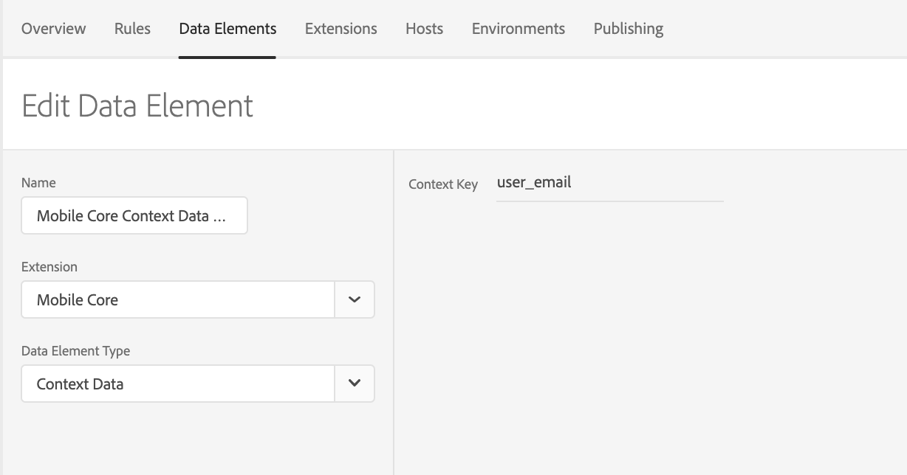
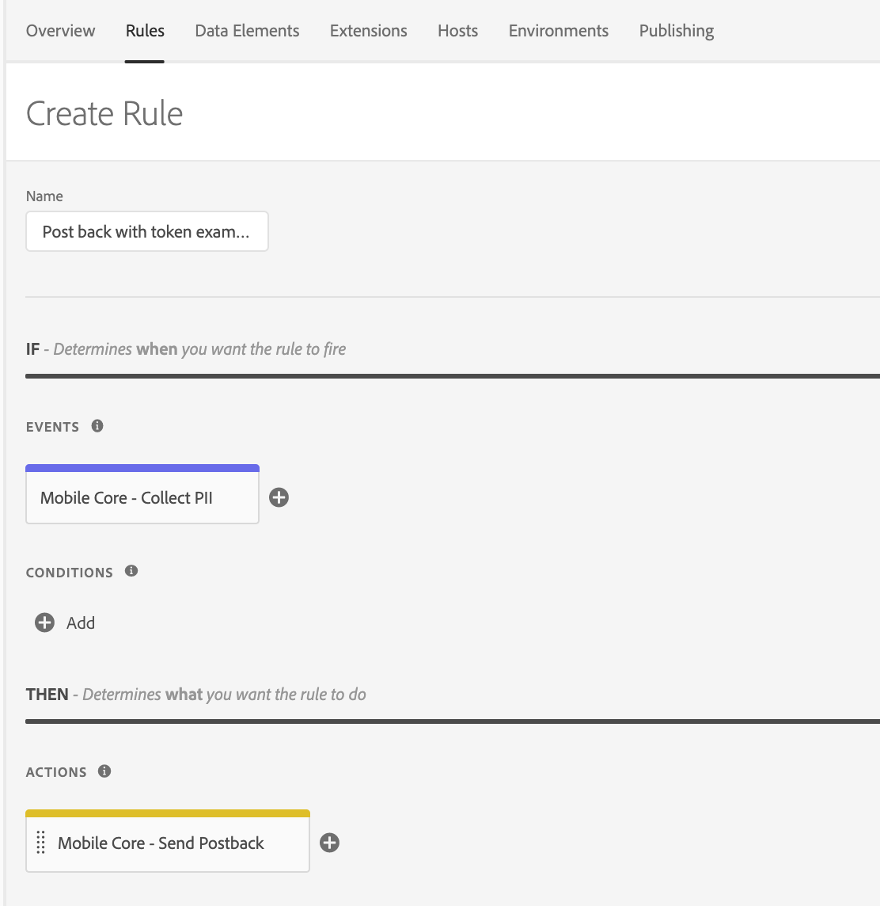

# Signal extension and Rules Engine integration

The rules that you set up can use the available triggers and conditions, which results in one of the following actions:

* Send Postback
* Send PII
* Open URL

After these actions have been configured to be triggered and published, the Signal extension carries out the requested actions.

To send PII data to external destinations, the `PII` action can trigger the Rules engine when certain triggers and traits match. When setting a rule, you can also set the `PII` action for a Signal event. The `collectPii` API can then be used to trigger the rule and send the PII data.

## Rules tokens <a id="rules-tokens"></a>

Rules tokens are special strings that are used in rule actions as values and are expanded by the SDK when the action is carried out. The format of a token is `{%%token%%}`, where token is any data element that is defined in Adobe Experience Platform Launch for a mobile property that identifies the source of the data from which the token is expanded. For example, `{%%My Data element for ECID%%}` can be used in the Signal postback action, where `My Data element for ECID` is a data element that was created using the Mobile Core extension, and the data element type is Experience Cloud ID.

The token can also be one of the reserved key names. For more information, see [Matching and Retrieving Values by keys](https://aep-sdks.gitbook.io/docs/using-mobile-extensions/mobile-core/rules-engine/rules-engine-details#matching-and-retrieving-values-by-keys).

Some tokens are modifier functions that specify the transformation that is applied to the value that was replaced by the token. An example is `urlenc`, which specifies that the value will be URL-encoded before it is replaced in the rule.

### Using tokens in Postbacks and PII rule actions <a id="using-tokens-in-postbacks-and-pii-rule-actions"></a>

The `Send Postback` and `Send PII` actions allow you to specify a `URL` field and an optional `Post Body` field. You can specify which tokens should be expanded by the Experience Platform SDKs when the postback or PII network call is triggered. For more information on tokens, see [Rule Tokens](https://aep-sdks.gitbook.io/docs/using-mobile-extensions/mobile-core/signals/signals-extension-and-rules-engine-integration#rules-tokens).

**Example**

Here is an example of how to use the data that is passed to the MobileCore \(Android\) / ACPCore \(iOS\) `collectPii` API to form a token:

1. In the mobile application, call collectPII to fire Event with context data.



```java
Signal.registerExtension();
...
Map<String, String> data = new HashMap<String, String>();
data.put("user_email", "user_001@example.com");
MobileCore.collectPII(data);
```



**Objective-C Example**

```text
[ACPSignal registerExtension];
...
[ACPCore collectPii:data:@{@"user_email" : @"user_001@example.com"}];
```

**Swift Example**

```swift
ACPSignal.registerExtension()
...
let piiContextData: [String: String] = ["user_email" : "user_001@example.com"]
ACPCore.collectPii(piiContextData)
```



2. In Adobe Experience Platform Launch, create a data element for the `user_email` context data key.



3. In Experience Platform Launch, create a new rule for sending a postback.

Create a new rule by selecting the Mobile Core Collect PII event and the Action Mobile Core Send Postback action as illustrated in the following graphic:



4. Select the data element that you created in step 1 for the Postback action.

Edit the `Send Postback` action and include the following URL in the corresponding edit box:

```text
https://my.company.com/users?email={%%Mobile Core Context Data email%%}
```


For more information about `collectPii` and its usage, see `collectPii` in [Mobile Core API reference](https://aep-sdks.gitbook.io/docs/using-mobile-extensions/mobile-core/mobile-core-api-reference#collect-pii).

### Using tokens in Open URL rule actions <a id="using-tokens-in-openurl-rule-actions"></a>

Similar to the example above, `Open URL` actions allow you to specify a URL, which can contain the tokens that will be expanded by the Experience Platform SDKs. For more information about tokens, see [Rule Tokens](https://aep-sdks.gitbook.io/docs/using-mobile-extensions/mobile-core/signals/signals-extension-and-rules-engine-integration#rules-tokens).

