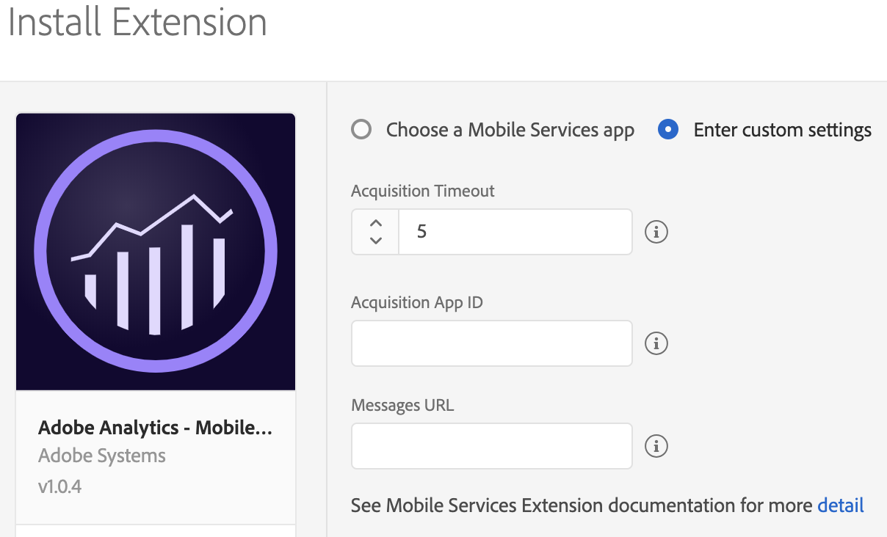

# Adobe Analytics - Mobile Services

This extension enables in-app messaging, push notifications, and marketing links functionality from [Mobile Services ](https://mobilemarketing.adobe.com)on the Experience Platform SDK.


The following steps require that you have previously created apps in [Mobile Services](https://mobilemarketing.adobe.com). To create an app in Mobile Services, please follow [these instructions](https://marketing.adobe.com/resources/help/en_US/mobile/t_new_app.html). 


To use the Mobile Services extension, complete these steps:

1. Configure the Mobile Services extension in Launch
2. Add Mobile Services extension to your app
3. Implement Mobile Services APIs in your app.

## Configure the Mobile Services extension in Launch

### Automatic Configuration \(Recommended\)


### Manual Configuration


The following instructions only apply if you don't see your app listed or need to configure your Mobile Services app, manually.


1. In Launch, click the **Extensions** tab.
2. Choose **Catalog**, locate the **Adobe Analytics – Mobile Services** extension, and click **Install**.
3.  **Choose a Mobile Services app** and complete the following tasks:
   1. In **Mobile Services app**, select app from the drop-down list.
   2. Click **Save**.
   3. Follow the publishing process to update the SDK configuration.



Choose **Enter Custom settings** and complete the following tasks

1. Enter an Acquisition time out \(recommended time out is 5 seconds\)
2. Provide the **Acquisition App ID** \(example value: `0eb9f2791f0880623f91e41e5309d2ae25066e513054a4cb59168dc886b526da)`\).
3. Provide the **Messages URL** \(example value: https://assets.adobedtm.com/b213432c5204bf94318f4ef0539a38b487d10368/scripts/satellite-5c7711bc64746d7f5800036e.json\)
4. Click **Save**.
5. Follow the publishing process to update your SDK configuration.

## Add Mobile Services extension to your app


The Mobile Services extension depends on the Core extension, which includes the Identity and Lifecycle frameworks and the Analytics extension.




Add the Mobile Services extension to your project using the app's Gradle file.

#### Java

Import the Mobile Services extension in your application's main activity.

```java
import com.adobe.marketing.mobileservices.*; 
```



Add the library to your project via your Podfile by adding the `ACPMobileServices`pod.

#### Objective-C

Import the library into your project:

```objectivec
#import "ACPCore.h"
#import “ACPIdentity.h”
#import “ACPLifecycle.h”
#import "ACPAnalytics.h"
#import "ACPMobileServices.h"
```



### Register Mobile Services with Mobile Core



#### Java

Call the `setApplication()` method once in the `onCreate()` method of your main activity. For example, your code might look like the following:

```java
public class MobileServicesApp extends Application {

@Override
public void onCreate() {
     super.onCreate();
     MobileCore.setApplication(this);

     try {
         	Analytics.registerExtension();
MobileServices.registerExtension(); //Register Mobile Services with Mobile Core
Lifecycle.registerExtension();
         	Identity.registerExtension();
         	MobileCore.start(null);
     } catch (Exception e) {
     //Log the exception
     }
  }
}
```



#### Objective-C

In your app's `application:didFinishLaunchingWithOptions` function, register the Mobile Services extension with the Mobile Core:

```objectivec
- (BOOL)application:(UIApplication *)application didFinishLaunchingWithOptions:(NSDictionary *)launchOptions {
   [ACPAnalytics registerExtension];
   [ACPLifecycle registerExtension];
   [ACPIdentity registerExtension];
   [ACPMobileServices registerExtension];
   [ACPCore start:nil]
   // Override point for customization after application launch.
   return YES;
}
```



## Implement Mobile Services APIs in your app

To use your Android or iOS extension with the Experience Platform SDKs, implement the following APIs:

### Push tracking



#### Objective-C

```objectivec
[ACPCore collectLaunchInfo:userInfo];
```



### In-app messaging



#### Java

If you are using Fullscreen message or local notification, update the Manifest:

```java
<activity android:name="com.adobe.mobile.MessageFullScreenActivity">
</activity>
<receiver android:name="com.adobe.mobile.MessageNotificationHandler" />
To 
<activity
    android:name="com.adobe.marketing.mobile.MessageFullScreenActivity"
    android:windowSoftInputMode="adjustUnspecified|stateHidden" >
</activity>
<receiver android:name="com.adobe.marketing.mobile.MessageNotificationHandler" />
If you were using the Referral receiver provided by Adobe, then update
<receiver
    android:name="com.adobe.mobile.ReferralReceiver"
    android:exported="true">
    <intent-filter>
        <action android:name="com.android.vending.INSTALL_REFERRER" />
    </intent-filter>
</receiver>
To 
<receiver
    android:name="com.adobe.marketing.mobile.ReferralReceiver"
    android:exported="true">
    <intent-filter>
        <action android:name="com.android.vending.INSTALL_REFERRER" />
    </intent-filter>
</receiver>
```



### Marketing Links



#### Java

```java
com.adobe.marketing.mobile.MobileServices.processReferrer
```



### Deep link tracking



#### Java

```java
MobileServices.trackAdobeDeepLink
```



#### Objective-C

```objectivec
[ACPMobileServices trackAdobeDeepLink:]
```



## Migration Notes

Please note the following:

* As lifetime value is not supported on the Experience Platform SDK, it may not be used to trigger in-app messages or local notifications.
* `ce` is no longer supported as a trigger for in-app messages or local notifications.
* `a.internalaction` or `action` \(from Lifecycle\) may be used to trigger in-app messages or local notifications. We suggest using LaunchEvent instead.
* Local notifications do not support Android 8.0 or higher.

### Configuration keys

### Additional information

* To see the Adobe Mobile Services documentation, go to [https://marketing.adobe.com/resources/help/en\_US/mobile/home.html](https://marketing.adobe.com/resources/help/en_US/mobile/home.html)
* To see the Adobe Mobile Services UI, go to [https://mobilemarketing.adobe.com/](https://mobilemarketing.adobe.com/).


