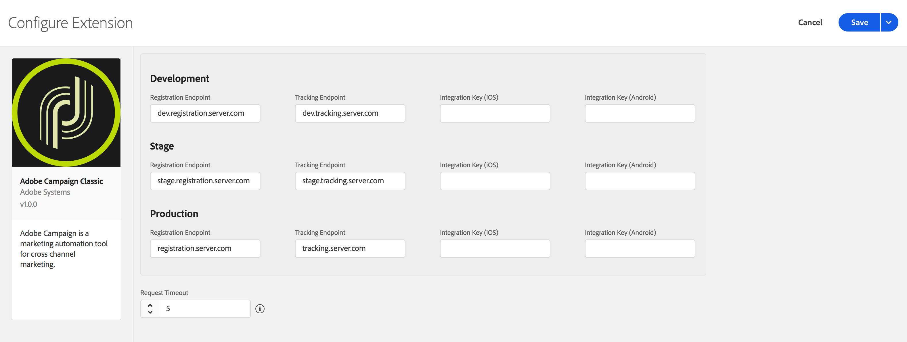

# Adobe Campaign Classic

## Configure Campaign Classic Extension in Launch

1. In Launch click the **Extensions** tab.
2. On the **Catalog** tab, locate the **Adobe Campaign Classic** extension and click **Install**.
3. Provide extension settings \(see screen capture below\)
4. Click **Save**.
5. Follow the publishing process to update SDK configuration

### Configure Campaign Classic Extension




Trying to find your ACC registration or tracking endpoint URLs? Contact your program manager.


#### Registration Endpoints

Provide registration endpoint URL\(s\) for your Campaign Classic instances. You may specify up to three unique endpoints for your development, staging, and production environments. 

#### Tracking Endpoints

Provide tracking endpoint URL\(s\) for your Campaign Classic instances. Like the registration URL's, you may specify up to three unique endpoints for your development, staging, and production environments. 

#### Integration Key (iOS)

You can specify up to three unique iOS integration keys for your development, staging, and production environments. iOS integration keys are generated after creating a service containing iOS applications using the Adobe Campaign Classic [client console](https://docs.campaign.adobe.com/doc/AC/en/INS_Installation_steps_for_Windows__Installing_the_client_console.html). For more information on where to find the integration key, please see [Configuring the mobile application in Adobe Campaign](https://docs.campaign.adobe.com/doc/AC/en/DLV_Sending_push_notifications_Setting_up_mobile_app_channel.html#Configuring_the_mobile_application_in_Adobe_Campaign).

#### Integration Key (Android)

Specify up to three unique Android integration keys for your development, staging, and production environments. Similar to iOS, Android integration keys are generated after creating a service containing Android applications using the Adobe Campaign Classic [client console](https://docs.campaign.adobe.com/doc/AC/en/INS_Installation_steps_for_Windows__Installing_the_client_console.html). For more information on where to find the integration key, see [Configuring the mobile application in Adobe Campaign](https://docs.campaign.adobe.com/doc/AC/en/DLV_Sending_push_notifications_Setting_up_mobile_app_channel.html#Configuring_the_mobile_application_in_Adobe_Campaign).

#### Request Timeout

Time in seconds to wait for a response from the registration endpoint before timing out.

## Add Campaign Classic to your app



Add the Campaign Classic extension to your project using the app's Gradle file.

#### Java

1. Import the CampaignClassic and Lifecycle extension in your application's main activity.

```java
import com.adobe.marketing.mobile.CampaignClassic;
import com.adobe.marketing.mobile.Lifecycle;
```





Add the Campaign Classic and [Mobile Core](mobile-core/) libraries to your project. You'll need to add the following pods to your `Podfile`:

```text
pod 'ACPCampaignClassic', '1.0.0'
pod 'ACPLifecycle', '1.0.0'
pod 'ACPCore', '1.0.0'
```

or you may manually include the [Mobile Core](https://github.com/Adobe-Marketing-Cloud/acp-sdks/releases/tag/v1.0.2b-ACPCore) and [Campaign Classic](https://github.com/Adobe-Marketing-Cloud/acp-sdks/releases/tag/v1.0.0-ACPCampaignClassic) extensions found in Github.

In Xcode, import the Mobile Core and Campaign Classic extensions:

#### Objective-C

```objectivec
#import <ACPCore_iOS/ACPCore_iOS.h>
#import <ACPCampaignClassic_iOS/ACPCampaignClassic_iOS.h>
#import <ACPLifecycle_iOS/ACPLifecycle_iOS.h>
```

#### Swift

```swift
import ACPCore_iOS
import ACPCampaign_iOS
import ACPLifecycle_iOS
```



### Register Campaign Classic with Mobile Core





In the App's OnCreate method register the Campaign Classic and Lifecycle extension:

```java
public class CampaignClassicTestApp extends Application {

	@Override
	public void onCreate() {
		super.onCreate();
		MobileCore.setApplication(this);
		MobileCore.setLogLevel(LoggingMode.VERBOSE);

		try {
			CampaignClassic.registerExtension();
            Lifecycle.registerExtension();
			MobileCore.start(null);
		} catch (Exception e) {
			Log.e("CampaignClassicTestApp", e.getMessage());
		}

	}
}
```




In your app's`application:didFinishLaunchingWithOptions:` method, register the Campaign Classic and Lifecycle extension:

#### Objective-C

```objectivec
- (BOOL)application:(UIApplication *)application didFinishLaunchingWithOptions:(NSDictionary *)launchOptions {
    [ACPCampaignClassic registerExtension];
    [ACPLifecycle registerExtension];
  // Override point for customization after application launch.
  return YES;
}
```

#### Swift

```swift
func application(_ application: UIApplication, didFinishLaunchingWithOptions launchOptions: [UIApplication.LaunchOptionsKey: Any]?) -> Bool {
   ACPCampaignClassic.registerExtension();
   ACPLifecycle.registerExtension();
  // Override point for customization after application launch.
  return true;
}
```



## Configuration Keys

If you need to update SDK configuration, programmatically, use the following information to change your Adobe Campaign Classic configuration values. For more information, [Configuration Methods Reference](../mobile-core/configuration-reference/#update-configuration).

<table>
  <thead>
    <tr>
      <th style="text-align:left">Key</th>
      <th style="text-align:left">Required</th>
      <th style="text-align:left">Description</th>
    </tr>
  </thead>
  <tbody>
    <tr>
      <td style="text-align:left">build.environment</td>
      <td style="text-align:left">Yes</td>
        <td style="text-align:left">Specifies which environment to use (prod, dev, or staging) when sending registration and tracking information. It is also used to specify which mobile app integration key to use.</td>
      </td>
    </tr>
    <tr>
      <td style="text-align:left">campaignclassic.timeout</td>
      <td style="text-align:left">No</td>
      <td style="text-align:left">Specifies the amount of time to wait for a response from the Adobe Campaign Classic registration server.
      </td>
    </tr>
    <tr>
      <td style="text-align:left">__dev__campaignclassic.marketingServer</td>
      <td style="text-align:left">No</td>
      <td style="text-align:left">Sets the development environment marketing server which receives registration requests.
      </td>
    </tr>
    <tr>
      <td style="text-align:left">__dev__campaignclassic.trackingServer</td>
      <td style="text-align:left">No</td>
      <td style="text-align:left">Sets the development environment tracking server which receives tracking requests. 
      </td>
    </tr>
    <tr>
      <td style="text-align:left">__dev__campaignclassic.ios.integrationKey</td>
      <td style="text-align:left">No</td>
      <td style="text-align:left">Sets the development environment iOS mobile app integration key which links the app to a specific iOS application campaign on Adobe Campaign Classic.
      </td>
    </tr>
<tr>
      <td style="text-align:left">__dev__campaignclassic.android.integrationKey</td>
      <td style="text-align:left">No</td>
      <td style="text-align:left">Sets the staging environment Android mobile app integration key which links the app to a specific Android application campaign on Adobe Campaign Classic.
      </td>
    </tr>
<tr>
      <td style="text-align:left">__stage__campaignclassic.marketingServer</td>
      <td style="text-align:left">No</td>
      <td style="text-align:left">Sets the staging environment marketing server which receives registration requests.
      </td>
    </tr>
    <tr>
      <td style="text-align:left">__stage__campaignclassic.trackingServer</td>
      <td style="text-align:left">No</td>
      <td style="text-align:left">Sets the staging environment tracking server which receives tracking requests. 
      </td>
    </tr>
    <tr>
      <td style="text-align:left">__stage__campaignclassic.ios.integrationKey</td>
      <td style="text-align:left">No</td>
      <td style="text-align:left">Sets the staging environment iOS mobile app integration key which links the app to a specific iOS application campaign on Adobe Campaign Classic.
      </td>
    </tr>
<tr>
      <td style="text-align:left">__stage__campaignclassic.android.integrationKey</td>
      <td style="text-align:left">No</td>
      <td style="text-align:left">Sets the staging environment Android mobile app integration key which links the app to a specific Android application campaign on Adobe Campaign Classic.
      </td>
    </tr>
</tr>
<tr>
      <td style="text-align:left">campaignclassic.marketingServer</td>
      <td style="text-align:left">Yes</td>
      <td style="text-align:left">Sets the production environment marketing server which receives registration requests.
      </td>
    </tr>
    <tr>
      <td style="text-align:left">campaignclassic.trackingServer</td>
      <td style="text-align:left">Yes</td>
      <td style="text-align:left">Sets the production environment tracking server which receives tracking requests. 
      </td>
    </tr>
    <tr>
      <td style="text-align:left">campaignclassic.ios.integrationKey</td>
      <td style="text-align:left">Yes</td>
      <td style="text-align:left">Sets the production environment iOS mobile app integration key which links the app to a specific iOS application campaign on Adobe Campaign Classic.
      </td>
    </tr>
<tr>
      <td style="text-align:left">campaignclassic.android.integrationKey</td>
      <td style="text-align:left">Yes</td>
      <td style="text-align:left">Sets the production environment Android mobile app integration key which links the app to a specific Android application campaign on Adobe Campaign Classic.
      </td>
    </tr>
  </tbody>
</table>