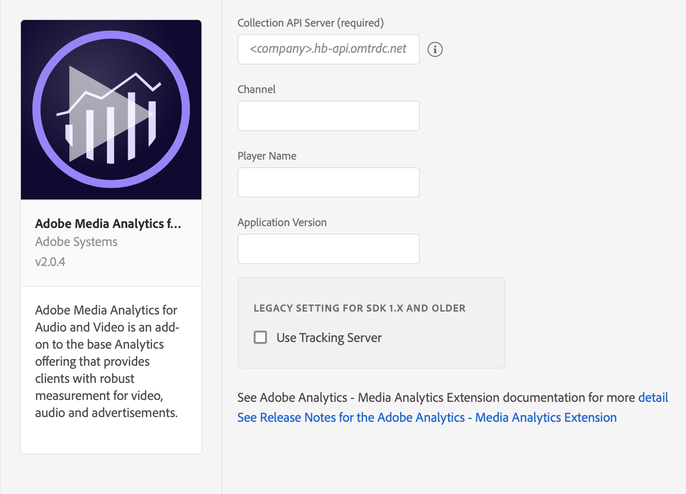

# Adobe Media Analytics for Audio and Video

## **Configure Media Analytics Extension in Launch**

1. In Launch, click the **Extensions** tab.
2. On the **Catalog** tab, locate the **Adobe Media Analytics for Audio and Video** extension and click **Install**.
3. Provide extension settings \(see [Configure Media Analytics Extension](#configure-media-analytics-extension)\)
4. Click **Save**.
5. Follow the publishing process, to update SDK configuration

### **Configure Media Analytics Extension**



#### **Tracking Server**


This is different from your Analytics tracking server.


Provide the tracking server to which all media tracking data should be sent.

#### **Channel**

Channel name property.

#### **Online Video Provider**

Name of the online platform through which content gets distributed.

#### **Player Name**

Name of the media player in use (e.g., "AVPlayer", "Native Player", "Custom Player").

#### **Application Version**

The version of the media player application/SDK.

#### **Debug Logging**

Enables or Disables Media SDK logs.


This should be disabled for your production application.


### Add Media Analytics to your app


This extension requires [Adobe Analytics Extension](../adobe-analytics/README.md) extension to function properly. You should add and correctly configure the analytics extension to your launch property.




Add the Media extension to your project using the app's Gradle file.

#### Java

1. Import the Media extension in your application's main activity.

```java
import com.adobe.marketing.mobile.*;
```




Add the library to your project via your Cocoapods `Podfile` by adding `pod 'ACPMedia'`

#### Objective-C

```objectivec
#import <ACPMedia_iOS/ACPMedia_iOS.h>
```

#### Swift

```swift
import ACPMedia_iOS
```




### Register Media with Mobile Core




#### Java

You may do the following after calling the `setApplication()` method in the `onCreate()` method. Here is code sample which calls these setup methods:

```java
public class MobileApp extends Application {

  @Override
  public void onCreate() {
      super.onCreate();
      MobileCore.setApplication(this);

      try {
          Media.registerExtension();  //Register Media with Mobile Core
          Analytics.registerExtension();
          Identity.registerExtension();
      } catch (Exception e) {

      }
  }
}
```




In your app's`application:didFinishLaunchingWithOptions`, register Analytics with Mobile Core:

#### Objective-C

```objectivec
- (BOOL)application:(UIApplication *)application didFinishLaunchingWithOptions:(NSDictionary *)launchOptions {
    [ACPMedia registerExtension];  //Register Media with Mobile Core
    [ACPAnalytics registerExtension];
    [ACPIdentity registerExtension];
    return YES;
  }
```

#### Swift

```swift
func application(_ application: UIApplication, didFinishLaunchingWithOptions launchOptions: [UIApplication.LaunchOptionsKey: Any]?) -> Bool {
    ACPMedia.registerExtension();  //Register Media with Mobile Core
    ACPAnalytics.registerExtension();
    ACPIdentity.registerExtension();
    return true;
}
```




## Configuration Keys

If you need to update SDK configuration, programmatically, please use the following information to change your Media configuration values. For more information, [Configuration Methods Reference](../mobile-core/configuration-reference/#update-configuration).

| Key                  | Required | Description                                           |
|----------------------|----------|-------------------------------------------------------|
| media.trackingServer |    Yes   | [See Tracking Server](#tracking-server)             |
| media.channel        |    No    | [See Channel](#channel)                             |
| media.ovp            |    No    | [See Online Video Provider](#online-video-provider) |
| media.playerName     |    No    | [See Player Name](#player-name)                     |
| media.appVersion     |    No    | [See Application Version](#application-version)     |
| media.debugLogging   |    No    | [See Debug Logging](#debug-logging)                 |